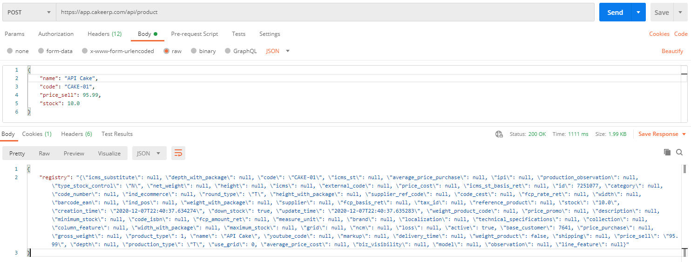

<a href ="https://www.cakeerp.com" target="_blank"></a>


# 🧁 Bem-vindo a API do Cake ERP !

Olá! Este projeto tem como objetivo principal, exemplificar o uso da API do Cake ERP. A nossa API de integração disponibiliza vários serviços através de webservices, para buscar, criar, editar e deletar registros referentes ao Cake.

## 🚀 Link API Completa

- https://app.cakeerp.com/api_docs/api.html

## ✔️ Introdução
Para ter acesso a nossa API, basta realizar um cadastro no Cake e entrar em contato com o suporte técnico, solicitando o Token de acesso, que será usado para realizar a request em nosso servidor, simples assim! Este token deverá ser passado no cabeçalho da request com a chave <b>“X-cake-token”</b>. Todas as requests devem utilizar <b>content-type application/json</b>.

Abaixo seguem dois exemplos utilizando o método GET e POST, para buscar informações e criar registros.

#### GET:

```sh
curl --location --request GET 'https://app.cakeerp.com/api/product/all' \
--header 'x-cake-token: Token' \
--header 'Content-Type: application/json'
```

<p>

#### POST:

```sh
curl --location --request POST 'https://app.cakeerp.com/api/product' \
--header 'x-cake-token: Token' \
--header 'Content-Type: application/json' \
--data-raw '{
    "name": "API Cake",
    "code": "CAKE-01",
    "price_sell": 95.99,
    "stock": 10.0
}'
```

<p>

Exemplos Utilizando:
- <b>(cURL)</b> - https://curl.se/
- <b>(Postman)</b> - https://www.postman.com/
<p>

## Erros de Retorno

```
    Acesso Negado: {‘status’:403, ‘message’:’Acesso Negado’}
    Operações: {‘error’: ‘mensagem do erro’}
```
